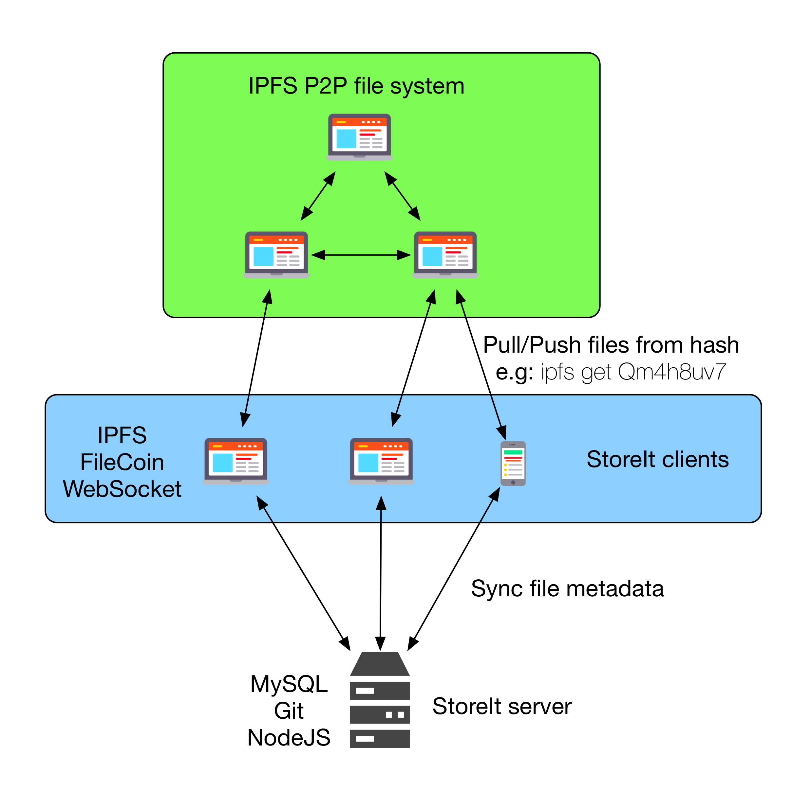

StoreIt - Stockage dans le cloud décentralisé
=============================================


Titre | Date | Sujet
------|----- | -----
2017_TD1_StoreIt.pdf | 1/5/2016 | Documentation Technique

Tableau des révisions

Date | Auteur | Section(s) | commentaire
------|----- | -----
1/5/2016 | Groupe StoreIt | Toutes | Rédaction initiale

Résumé
------

Ce document est une présentation technique du projet. Il couvre la conception et sert de guide a toute personne souhaitant contribuer au projet. Nous y évoquont les différents composants logiciels (client, serveur, appli Android, appli iOS, appli web) et décrivons l'organisation du code, des tests, du déploiement, etc.


<!-- START doctoc generated TOC please keep comment here to allow auto update -->
<!-- DON'T EDIT THIS SECTION, INSTEAD RE-RUN doctoc TO UPDATE -->

- [Le serveur StoreIt](#le-serveur-storeit)
  - [Le protocole de communication réseau](#le-protocole-de-communication-r%C3%A9seau)
- [Contribuer au projet](#contribuer-au-projet)
    - [Obtenir le code](#obtenir-le-code)
    - [Norme](#norme)
    - [Les tests](#les-tests)
- [Application Android de StoreIt](#application-android-de-storeit)
  - [Liste des logiciels requis](#liste-des-logiciels-requis)
  - [Procédure de mise en place du projet](#proc%C3%A9dure-de-mise-en-place-du-projet)
  - [Architecture du projet](#architecture-du-projet)
  - [Procédure de test](#proc%C3%A9dure-de-test)
- [Application iOS de StoreIt](#application-ios-de-storeit)
- [Conception du projet](#conception-du-projet)
  - [Tests unitaires](#tests-unitaires)
  - [Norme](#norme-1)
- [Appli Web](#appli-web)
- [Technologies:](#technologies)
- [Structure:](#structure)
  - [Développement:](#d%C3%A9veloppement)

<!-- END doctoc generated TOC please keep comment here to allow auto update -->

## Le serveur StoreIt ##

StoreIt est un service de cloud décentralisé. Du point de vue d'un utilisateur, il est possible de synchroniser un dossier dans le cloud. Il est aussi possible de louer un disque au réseau StoreIt. Dans cette situation, le client est considéré comme un hébergeur va stocker de manière automatisée les données des autres utilisateurs.



### Le protocole de communication réseau ###

La communication entre les clients et le serveur se fait via un protocole ASCII qui fonctionne au dessus du protocole WebSocket.

La documentation du protocole est disponible dans le dépot (https://github.com/Sevauk/storeit/blob/master/document/protocol/protocol.pdf)

Contribuer au projet
--------------------

#### Obtenir le code

Le code source du serveur est disponible sur github (https://github.com/Sevauk/storeit).

```bash
git clone https://github.com/Sevauk/storeit
```

Consultez le document sur l'installation pour installer et lancer le serveur.

#### Norme

Le code doit respecter les normes ECMAScript en utilisant ESLint.

#### Les tests

Les outils qui sont utilisés ou qui vont être mis en place prochainement sont les suivants :

travis CI + slack intégration avec des webhooks
istanbul (test coverage)
mocha (test framework)
chai (test DSL)
coffeescript (language) pour les tests unitaires.


## Application Android de StoreIt ##

### Liste des logiciels requis

 - Android Studio 2.1
 - Git

----------

### Procédure de mise en place du projet

 - Cloner le dépot git
 - Depuis Android Studio ouvir le projet situé dans le répertoire **/src/android-app/StoreIt**
 - L'ensemble des bibliothèques nécessaires seront automatiquement télechargées via une tâche gradle
 ----------
### Architecture du projet

Le projet est organisé autour de 3 grandes parties :

 1. Un module de gestion reseau (websocket)
 2. Un module de gestion des fichiers
 3. L'ensemble du code lié à l'interface utilisateur
 ----------
Chacun de ces modules se situe dans un package Java différent

### Procédure de test

Des tests unitaires ont été mis en place. Ils reposent sur l'utilisation de JUnit dont l'utilisation est détaillée ici :
http://developer.android.com/tools/testing/testing_android.html
Pour l'instant seulement la fonctionnalité de création de hash utilise des tests unitaires.

## Application iOS de StoreIt ##

Conception du projet
--------------------

Le projet est constitué de trois parties principales :

* Network

Cette partie contient toutes les classes relatives à la gestion du réseau, en l'occurence les classes `Server` et `Client`, ainsi que plusieurs classes utilitaires, comme la classe `RequestBuilder` qui permet la construction des requêtes envoyées par les deux classes citées précédemment. `Client` permet de recevoir et d'envoyer des requêtes au serveur, alors que `Server` permet de recevoir et d'envoyer des requêtes à d'autres clients.

* FileManagement

Cette partie contient toutes les classes relatives à la gestion de fichier, aussi bien la gestion du dossier synchronisé StoreIt que le dossier de stockage des chunks.

* Views

Cette partie contient toutes les vues de l'application.

### Tests unitaires ###

Les tests unitaires se trouvent dans leurs dossiers respectifs Xcode : `StoreItTests` et `StoreItUITests`. Ces dossiers contiennent des sous-dossiers correspondantes aux parties évoquées ci-dessus.

### Norme ###


Il n'y a pas de norme de codage particulière, si ce n'est qu'il faut suivre au possible les conventions établies par Apple [Consulter ces conventions ici](https://developer.apple.com/library/ios/documentation/Swift/Conceptual/Swift_Programming_Language/TheBasics.html#//apple_ref/doc/uid/TP40014097-CH5-ID309).

## Appli Web ##

Technologies:
-------------

* Langage: JavaScript (ES2015 + Tc39 stage-3)
* Framework: AngularJS 1.5+
* Templates: Jade
* Stylesheets: PostCss
* Gestionnaire de dépendances: JSPM
* Automatiseur de tâches: Gulp
* Testing: Karma + Mocha + Chai + Istanbul

Structure:
----------

Les sources de l'application sont organisées en `Modules` Angular.
L'application contient 2 types de modules:

1. **Components**: Route + Controlleur + Vue (Template et Style). Un component est intimement lié à ça vue, mais peut être composé à partir de component plus petits.

2. **Core**: Contient de la logique réutilisable (principalement des services et models)

Example de component:
```
home
|  home.js
|  home.jade
|  home.css
|
|__sidebar
   | sidebar.js
   | sidebar.jade
   | sidebar.css
```

Développement:
--------------
Suivre les instructions d'installation, puis utilisez:

```
npm run dev
```
